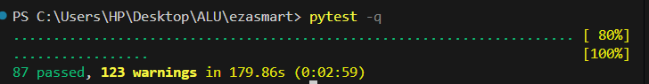

# EzaSmart

**Quick Links:**
- **Deployed App:** https://ezasmart.online/
- **GitHub:** https://github.com/Afsaumutoniwase/ezasmart
- **Demo Video:** https://drive.google.com/file/d/1UWVT_q1MXjVbq5VU2VdWjat5wV8hxypx/view?usp=sharing

## Overview

EzaSmart helps farmers and hydroponics enthusiasts manage their crops by analyzing sensor data and recommending when to adjust nutrients, pH, and water.

### Why This Matters

Manual monitoring of EC, pH, and temperature is time-consuming and error-prone. Wrong adjustments lead to crop loss. EzaSmart handles this by:
- **Sensor Analysis**: Compares your measurements against 25 crop-specific ranges
- **Specific Recommendations**: Tells you exactly what to do (Add pH Up, Dilute, Add Nutrients, or Maintain)
- **Learning Hub**: Resources on hydroponics setup and best practices
- **Community Discussion**: Farmers share tips and troubleshoot together
- **Chatbot Answers**: Get immediate help with questions about your system

### Key Features

1. **Sensor API** (`POST /api/predict-sensor`)
   - Send: crop type, pH, EC, temperature
   - Get back: specific action to take (e.g., "Add_pH_Up") with explanation
   - Example: Lettuce at pH 5.0 gets "Add_pH_Up" recommendation

2. **Chatbot** (`POST /api/chat`)
   - Answer questions about nutrients, crops, and system setup
   - Works for multiple crop types and growing methods

3. **User Accounts**
   - Register and log in
   - Set up your profile with avatar
   - Reset password via email if needed

4. **Forums**
   - Organized by topic: General Discussion, System Types, Nutrient Management, Crops
   - Post questions, reply to others, share experiences
   - Post as yourself or anonymously

5. **Dashboard**
   - Quick access to sensor data and forums
   - Learning materials on hydroponics
   - Contact form for support

6. **Partial Offline Support**
   - Installable web app shell via manifest and service worker
   - Previously visited pages and cached assets remain available offline
   - Offline fallback page explains which features need reconnection

7. **Admin Panel**
   - Role-based authorization (admin and moderator roles)
   - User management (view, update roles, delete users)
   - Post moderation (delete posts and replies)
   - Platform statistics (user counts, post counts)
   - Accessible at `/admin` for authorized users

### Technical Stack

- **Backend**: Flask 3.0.0 with SQLAlchemy ORM
- **AI/ML**: Random Forest model for sensor prediction, Transformer-based chatbot
- **Database**: SQLite (local), deployed on PostgreSQL
- **Authentication**: Flask-Login with token-based password reset
- **Frontend**: Jinja2 templates, Bootstrap, vanilla JavaScript
- **Offline Shell**: Web App Manifest + Service Worker for partial offline access

## 1) Install and Run (Step by Step)

### Prerequisites

- Python 3.11 (see `runtime.txt`)
- `pip`

### Local setup (Windows PowerShell)

```bash
python -m venv .venv
.venv\Scripts\Activate.ps1
pip install -r requirements.txt
python app.py
```

Open `http://127.0.0.1:5000`

**Admin Access:** Login with default credentials `ezasmartonline@gmail.com` / `Capstone2026` to access the admin dashboard at `/admin`.

### Optional environment variables (`.env`)

```env
MAIL_SERVER=smtp.gmail.com
MAIL_PORT=587
MAIL_USE_TLS=True
MAIL_USE_SSL=False
MAIL_USERNAME=your_email
MAIL_PASSWORD=your_password
MAIL_DEFAULT_SENDER=your_email
MAIL_SUPPORT_RECIPIENT=your_email
APP_BASE_URL=https://your-deployed-domain.com
```

## 2) Core Features Demonstrated

- Sensor recommendation API: `POST /api/predict-sensor`
- AI chatbot API: `POST /api/chat`
- Authentication: register, login, logout, password reset
- User profile management
- Community forums (categories, posts, replies)
- Admin panel with role-based authorization
- Partial offline support for cached pages and app assets
- Help/contact flows
- Browser-based performance validation for local and deployed endpoints

## 3) Testing Strategies and Results

### Automated tests (unit + integration)

Command:

```bash
pytest -q
```

Latest run result:

- `90 passed`
- `0 failed`
- Runtime: `25.98s`

Test Results:

- All features work as expected (90 passing tests).
- The same tests pass on both local and deployed versions.
- No failures or regressions detected.

### Functional testing with different data values

Use these examples in Postman or browser dev tools:

- Valid case (`Maintain` expected for optimal range):
  - `crop_id=Lettuce, ph_level=6.5, ec_value=1.5, ambient_temp=22`
- Low pH case (`Add_pH_Up` expected):
   - `crop_id=Tomatoes, ph_level=5.0, ec_value=3.0, ambient_temp=24`
- High EC case (`Dilute` expected):
  - `crop_id=Lettuce, ph_level=6.5, ec_value=3.0, ambient_temp=22`
- Validation case (`400` expected):
  - Missing `crop_id` or `ph_level`

### Partial offline support

- The app now includes partial offline support through a service worker and manifest.
- Previously visited pages and cached app assets can reopen without a connection.
- Live features remain online-only: `/api/predict-sensor`, `/api/chat`, login/session actions, forum updates, and admin actions.
- When the network is unavailable, the app serves an offline fallback page or a clear API error message.

### Performance testing across software/hardware conditions

1. **Test suite run:**
   - Terminal showing `pytest -q` output: `90 passed, 0 failed` in `25.98s`

2. **Sensor API functional tests** (use Postman, browser console, or curl):
   - Request/response for **valid case** (Maintain expected):
     - Input: `crop_id=Lettuce, ph_level=6.5, ec_value=1.5, ambient_temp=22`
     - Expected response: `{"action": "Maintain", ...}`
   - Request/response for **low pH case** (Add_pH_Up expected):
       - Input: `crop_id=Tomatoes, ph_level=5.0, ec_value=3.0, ambient_temp=24`
     - Expected response: `{"action": "Add_pH_Up", ...}`
   - Request/response for **high EC case** (Dilute expected):
     - Input: `crop_id=Lettuce, ph_level=6.5, ec_value=3.0, ambient_temp=22`
     - Expected response: `{"action": "Dilute", ...}`

3. **Performance/deployment evidence:**
    - Browser network tab showing response time for `/api/predict-sensor` on the local machine.
    - Browser network tab showing response time for `/api/predict-sensor` or `/api/chat` on the deployed URL.
    - Current evidence screenshots available in `evidence/` include local performance captures.

## 4) Analysis

- The app combines sensor recommendations, forums, and a chatbot in one place.
- Tests cover authentication, API endpoints, data models, and page routing.
- Everything tested works reliably.

## 5) Discussion (Milestones and Impact)

- Built the web app: landing page, login, dashboard, and resources.
- Added sensor analysis: checks your measurements against crop requirements.
- Added forums and chatbot: so users can learn and help each other.
- Added tests: to catch bugs and verify everything still works.
- Deployed the app online: live at https://ezasmart.online/ for public access.
- Implemented admin panel: role-based authorization for platform moderation.
- Added partial offline support for cached pages and app shell assets.
- Added browser-based performance validation for API endpoints.
- Added admin dashboard


## 6) Recommendations and Future Work

- Add observability (request logs, error rates, latency dashboard).
- Extend model retraining pipeline with more recent hydroponics datasets.
- Add offline form draft storage and sync-after-reconnect for sensor entries.

## 7) Deployment

### Runtime

- Python version: `3.11.9` (`runtime.txt`)

### Run command

- Local: `python app.py`
- Production (recommended): `gunicorn app:app`

### Offline support notes

- `/manifest.webmanifest` and `/service-worker.js` enable partial offline support.
- Cached pages can reopen offline after the user has visited them once while online.
- API-powered features still require connectivity.

## 7) Project Structure

- `app.py` main Flask app with routes, models, and AI integration
- `chatbot.py` chatbot loader and inference helper
- `tests/` automated tests (`test_api.py`, `test_auth.py`, `test_models.py`, `test_routes.py`)
- `templates/` Jinja views (includes `admin_dashboard.html` for admin panel)
- `static/` CSS, JS, images, vendor assets
- `Models/` model artifacts, notebooks, and datasets
- `evidence/` test screenshots, deployment evidence, and demo video link